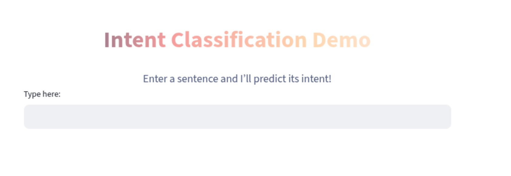
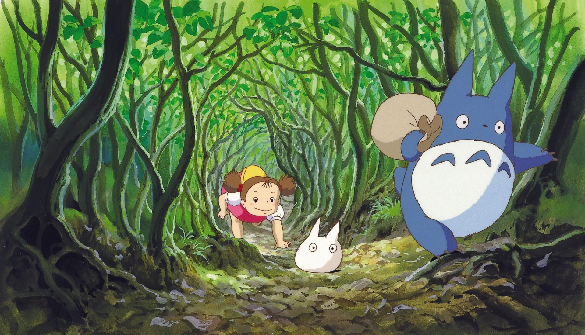
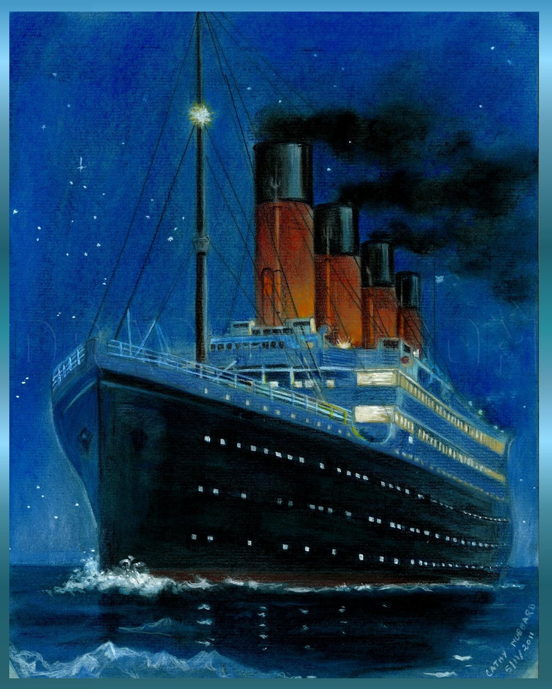

### Education
**B.S in Computer Science, Minor in Creative Writing** – Rutgers University, New Brunswick (2027)

Hi! This is my portfolio for all my coding projects. 
Here is a summary of my experience: 

 **Applied AI Engineering Fellow**  @ CodePath
- Using Claude Code AI-Native engineering, learning to critically evaluate, debug, and improve AI-generated code, as well as building chatbots and summarization
  
 **Machine Learning Intern** @ eCLOUD Labs Inc
-  Building an end-to-end NLP-based resume authenticity detection system (anti-fraud tool) using Python, Pandas, Scikit-learn, and Regex to extract features like broken links and date inconsistencies.
  
### Projects (Please click on the titles to view the projects)

#### 🔍 [Intent Classifier with DistilBERT Transformer](https://bert-intent-classification.streamlit.app/)

  

**Tools:** Python, PyTorch, HuggingFace, Streamlit

 Built and deployed a **DistilBERT-based text classification** model on the SNIPS dataset with **7 possible
user-intents**, achieving **99.156 % accuracy**
- Implemented data preprocessing, tokenization, and stratified train/validation/test splits in both Logistic
Rgression and DistilBERT using **Pandas, scikit-learn, and Hugging Face Datasets**
- Fine-tuned DistilBERT with Hugging Face Transformers and **visualized results with confusion matrices**
and classification reports, also **comparing performance tradeoffs**
- **Deployed model on Hugging Face Hub** and built an **interactive Streamlit app** for real-time intent
prediction

[Link to github repo](https://github.com/priyankapanga/Intent-Classification)

#### 🎥 [Studio Ghibli Films Revenue Analysis](https://priyankapanga-studio-ghibli-revenue-analysis.streamlit.app)

  

**Tools:** SQL (SQLite), Python (NumPy, Pandas, Seaborn), Streamlit, Jupyter Notebooks, Excel, Google Sheets  
I explored what makes a Studio Ghibli film successful at the box office by cleaning and analyzing a custom dataset of their movies.  
- Queried data using **SQLite** and **DB Browser**
- Processed and visualized data using **Pandas**, **NumPy**, **Seaborn**
- Built an interactive dashboard using **Streamlit**
- Visualized trends with **Seaborn**, **Excel**, and **Google Sheets**  
-> The dataset gained **50+ downloads on Kaggle**, showing strong community interest.  

[Link to github repo](https://github.com/priyankapanga/Studio-Ghibli-Revenue-Analysis)

---

#### 🚢 [Titanic Survival Prediction: Random Forest vs Logistic Regression](https://github.com/priyankapanga/Titanic-Survival-Prediction)

   

**Tools:** Python, NumPy, Pandas, Scikit-learn, Jupyter Notebooks 
- Used **scikit-learn** to compare **Logistic Regression** and **Random Forest** models  
- Found Logistic Regression was **2.3% more accurate**  
- Visualized trends and survival patterns using **Seaborn** in Jupyter Notebooks
  

---

#### 🎭 [OnceUponAMood (iOS App, submitted to HackHERS Hackathon 2025)](https://github.com/priyankapanga/OnceUponAMood)
**Tools:** Xcode (Swift, SwiftUI), OpenAI API  
An AI-powered journaling app for GenZ that detects users' moods from journal entries and offers personalized advice, movie recommendations, and music suggestions.  
- Built the app using Xcode, Swift, and SwiftUI for a seamless, responsive user interface.
- Integrated OpenAI’s API for sentiment analysis and tailored recommendations based on journal entries.
- Designed a user-friendly and calming interface to encourage regular journaling and emotional exploration.
- Focused on mood-based personalization to improve user engagement and emotional well-being, specifically tailored to GenZ.

[Devpost Link](https://devpost.com/software/soulscribe-csbx4p)

---

### Sources for the Images on this page: 
https://ghiblicollection.com
https://dragoart.com/tut/how-to-draw-the-titanic-titanic-8090
